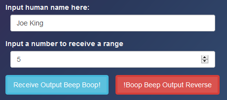
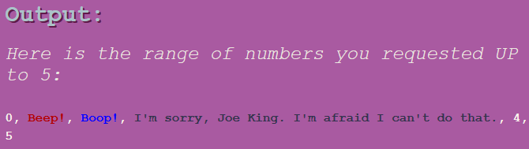

# _Beep Boop_

#### _Week 3 Independent Friday Assignment for Epicodus, 01.24.2020_

#### By _**Tiffany Siu**_

## Description

_This site is the Week 3 Friday independent assignment for Epicodus' full time Intro to Programming and C#/React course.  It takes in an integer number from user input and returns a string of numbers counting up to the inputted number starting at 0.  The program will also check if the number includes specific digits and replace them with another string._

_In this program a "3" will be replaced with "I'm sorry Dave. I can't do that.", a "2" will be replaced with "Boop!", and a "1" will be replaced with "Beep!".  There is also a priority system so that it will know which replacement to use if the number being printed contains multiple digits to be replaced (the preference being 3 > 2 > 1 in this program).  The picture also changes with the input contains a "5".  This program can also display the resulting output in reverse and give the user name that was inputted in instead of the default "Dave" when 3's are replaced._ 

_This assignment specifically practiced writing specifications prior to coding and manipulating arrays and loops to create the wanted output._

## Setup/Installation Requirements

### Requirements to Run
* _Web Browser_

### Other Resources Used
* _JQuery_
* _Bootstrap_

_This page may be viewed by cloning the [repository](https://github.com/TSiu88/beep-boop.git) from my [GitHub page](https://github.com/TSiu88) and opening the **index.html** file in any web browser._

## Technologies Used

* _HTML_
* _CSS_
* _Javascript_
* _JQuery_
* _Bootstrap_
* _Markdown_

## Notable Features
_Several different design features were used on this page which I had no experience with previously. I added animations such as the continuous gradient effect in the background as well as wiggle animations to the buttons and highlighting effects to the input boxes when the mouse hovers over them.  The input or output would also change pictures and text colors of the html file from the javascript file._

## Specifications

* _The program gives an alert and does nothing if user inputs a non-numeric number character or leaves field blank_
  * _Example Input: ""_
  * _Example Output: alert: "No valid number inputted. Please enter a number in space provided."_
* _The program returns a range of numbers from 0 to the users inputted number_
  * _Example Input: "4"_
  * _Example Output: "0, 1, 2, 3, 4"_
* _The program replaces "Beep!" for all numbers that contain a "1" and returns the range of numbers from 0 to the input number._
  * _Example Input: "4"_
  * _Example Output: "0, Beep!, 2, 3, 4"_
* _The program replaces "Boop!" for all numbers that contain a "2" and returns the range of numbers from 0 to the input number._
  * _Example Input: "4"_
  * _Example Output: "0, Beep!, Boop!, 3, 4"_
* _The program replaces "I'm sorry, ...  I'm afraid I can't do that" for all numbers that contain a "3" and returns the range of numbers from 0 to the input number._
  * _Example Input: "4"_
  * _Example Output: "0, Beep!, Boop!, I'm sorry..., 4"_
* _The program prioritizes replacing "2" and "3" over replacing "1" if both digits are in the same number_
  * _Example Input: "21"_
  * _Example Output: "0, Beep!, Boop!, I'm sorry..., 4, 5, 6, 7, 8, 9, Beep!, Beep!, Boop!, I'm sorry..., Beep!, Beep!, Beep!, Beep!, Beep!, Beep!, Boop!, Boop!"_
* _The program prioritizes replacing "3" over replacing "2" if both digits are in the same number_
  * _Example Input: "23"_
  * _Example Output: "0, Beep!, Boop!, I'm sorry..., 4, 5, 6, 7, 8, 9, Beep!, Beep!, Boop!, I'm sorry..., Beep!, Beep!, Beep!, Beep!, Beep!, Beep!, Boop!, Boop!, Boop!, I'm sorry..."_
* _The program uses name user input in field during "I'm sorry..." string if given, or uses default name "Dave" if left blank._
  * _Example Input: "Human"_
  * _Example Output: "I'm sorry Human. I'm afraid I can't do that."_
* _The program will show output in reverse order if the button to reverse order is pushed._
  * _Example Input: "5"_
  * _Example Output: "5, 4, I'm sorry, Dave. I'm afraid I can't do that., Boop!, Beep!, 0"_
* _The program changes the picture to a different one when the user input contains a "5"_
  * _Example Input: "5" (picture of robot)_
  * _Example Output: (picture of cake)_

## Screenshots
_Here is a snippet of what the input looks like:_

_Here is a preview of what the output looks like:_

## Known Bugs

_There are currently no known bugs in this program_

## Support and contact details

_If there are any question or concerns please contact me at my [email](mailto:tsiu88@gmail.com). Thank you._

### License

*This software is licensed under the MIT license*

Copyright (c) 2020 **_Tiffany Siu_**
